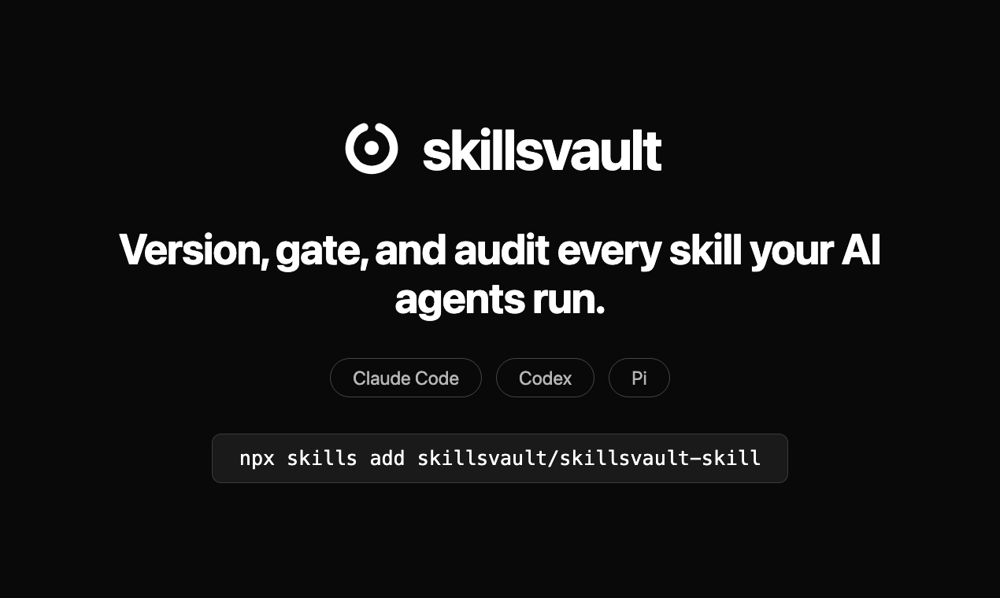

<div align="center">



<br />

[](https://skillsvault.io)
[](https://skillsvault.io/docs)
[](./LICENSE)

**The control plane for agent skills.**
One skill that connects your agent to your organisation's registry —
install what's approved, block what's banned, audit everything.

Works with **Claude Code** · **Codex** · **Pi** · every other harness

</div>

---

## ⚡ Add it to your agent

```bash
npx skills add skillsvault/skillsvault-skill
```

That's it. Your agent reads the skill and bootstraps itself — it installs the
`skillsvault` CLI, asks you to sign in once, then pulls your organisation's
approved skills into every harness on the machine:

```bash
curl -fsSL https://skillsvault.io/install.sh | sh
skillsvault login
skillsvault pull --all
```

## 🎬 See it work

<div align="center">

</div>

## 🧭 Why

Agents pick up skills from everywhere — repos, marketplaces, teammates, other
agents. Nobody knows which version runs where, and a poisoned or outdated
skill looks exactly like a good one. skillsvault gives your organisation one
source of truth:

| | |
|---|---|
| 📦 **Versioned registry** | Every skill content-addressed, versioned, and signed. `pull` installs the approved version — and removes banned ones. |
| 🚦 **The gate** | Every invocation checked locally, before it runs: **allow / warn / halt**. Works offline from a cached policy bundle. |
| 🧾 **Audit trail** | Who ran which skill version, on which host, under which policy — append-only and exportable. |
| 🕸️ **Every harness** | One policy for Claude Code, Codex, Pi, and anything else that runs skills. |

## 🛠️ What your agent does with it

Once connected, the skill teaches your agent to govern itself:

```bash
skillsvault whoami                    # which org am I connected to?
skillsvault install-hook              # gate every skill invocation (Claude Code)
skillsvault pull --all                # install approved skills, remove banned ones
skillsvault gate --skill <org/skill>  # allow / warn / halt — before use
skillsvault publish <path>            # push a skill to the org registry
skillsvault status                    # how fresh is the policy bundle?
```

Three rules the skill enforces, always:

1. If the gate **halts** a skill → the agent does not run it. Ever.
2. The approved version from `pull` beats any sideloaded copy.
3. A halt is never bypassed — the verdict names the approved replacement.

## 📚 Learn more

- 📖 [Documentation](https://skillsvault.io/docs) — CLI reference, policies, the signed bundle contract
- 🚀 [Quickstart](https://skillsvault.io/docs/quickstart) — zero to governed in five minutes
- 🔍 [`SKILL.md`](./SKILL.md) — the skill itself, exactly what your agent reads
- 🧾 [`references/cli.md`](./references/cli.md) — full command reference

## License

Proprietary — property of skillsvault. See [LICENSE](./LICENSE).

<div align="center">
<sub>Built in Germany 🇩🇪 · <a href="https://skillsvault.io">skillsvault.io</a> · <a href="mailto:info@skillsvault.io">info@skillsvault.io</a></sub>
</div>
